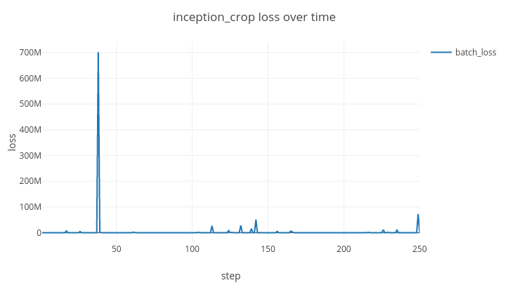

## Deep Spectral Clustering Learning

Pytorch Implementation of [Deep Spectral Clustering Learning](http://www.cs.toronto.edu/~law/publications/ICML/2017/final_version.pdf), the state of the art of Deep Metric Learning Paper.

## Requirements

- Python 3.6+
- Pytorch 0.4.0+
- visdom

## Usage

Currently only fine-tuning method on CARS dataset is supported.

If you want to use your own custom data set, look at the class CustomDataset in data_loader.py and datasets.py

## Dataset
[CARS196](https://ai.stanford.edu/~jkrause/cars/car_dataset.html)

## Usage

### Visualize
- To visualize intermediate results and loss plots, run `python -m visdom.server` and go to the URL http://localhost:8097

### Train
    $ python train.py --data_dir=/data_path --width_size=299 --lr=1e-5 --label_size=98 --large_batch_epoch=400 --large_batch_size=100 --small_batch_size=60 --dropout_rate=0.30 --model=inception_crop

### Test
    $ python test.py --data_dir='/hdd/DeepSpectralClustering/data' --width_size=299 --large_batch_epoch=410 --k=8 --model=inception

## Implementation Comments
- There are 2 methods(last layer / end-to-end) described in the paper, But I only included fine-tuning method because of the GPU memory issue.
- This code does not include `DSCL Normalized Spectral Clustering`, which is a post processing method to improve score metric.
- Loss function is implemented as "implementation detail" described in the paper.
- I used top@k recall score for testing, except NMI score with K-means clustering.

## Training Comments
- Training of DSCL is very sensitive to batch size, learning rate, image augmentation and dropout rate. I strongly suggest handle these hyper parameters carefully.
- I achieved about 80% top@8 recall score on CARS data set, but it is low compared to 93% top@8 recall score in the paper.
- Metric score in the paper can be achieved with proper hyper parameters.
- To prevent training explosion, I skipped applying gradient when loss is more than 500M

## Results on CARS data set

### Training Graphs

### Metric Scores
Top K Recall|R@1|R@2|R@4|R@8
:----:|:--------:|:---------:|:------:|:-------:
Test Score|45.91|58.60|70.74|80.88
Scores In The Paper|67.54|77.77|85.74|90.95

## Code reference

Visualization code(visualizer.py, utils.py) references to pytorch-CycleGAN-and-pix2pix(https://github.com/junyanz/pytorch-CycleGAN-and-pix2pix) by [Jun-Yan Zhu](https://github.com/junyanz)

## Author

[Tony Kim](https://github.com/wlwkgus)